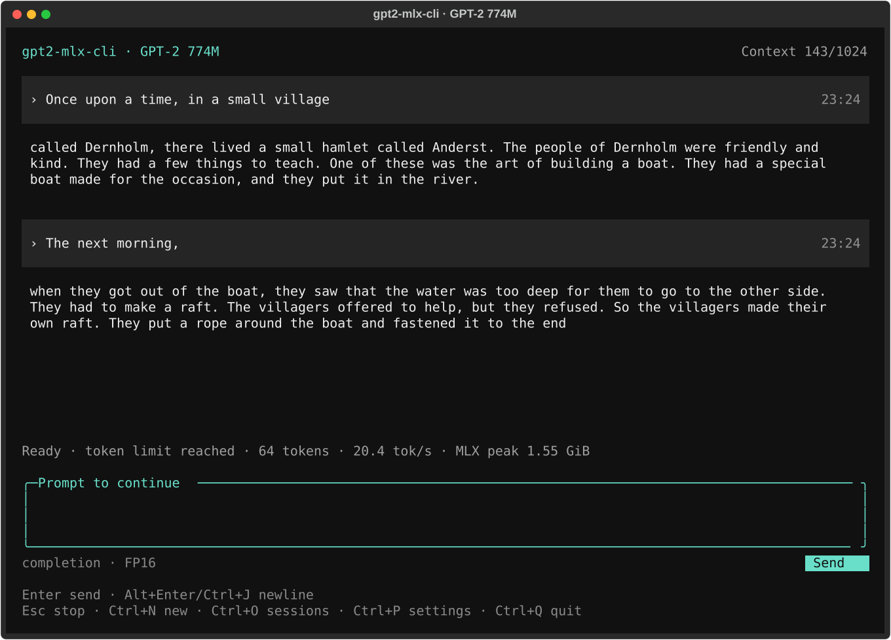

# gpt2-mlx-cli

A local GPT-2 774M playground for Apple Silicon Mac, with a from-scratch MLX inference engine and a chat-style Textual interface for raw text completion. Just an old-generation language model in your terminal.



## Features

- FP16 and 8-bit inference, with streamed output and cancellation.
- Raw text completion with session context, without a system prompt or role markers.
- Saved conversations and adjustable generation settings.
- Local inference with no remote chat service.
- A lightweight engine built directly on MLX, without PyTorch or Transformers at runtime.

## Quick start

Run these commands from the project directory:

```sh
uv sync
uv run gpt2-mlx-cli download
uv run gpt2-mlx-cli
```

The first download is approximately 3.25 GB. Once the dependencies and model are available, inference works offline. The TUI loads the model on your first message and keeps it in memory for later conversations.

## Usage

```sh
# Use 8-bit weights
uv run gpt2-mlx-cli chat --precision int8

# Generate directly from the command line
uv run gpt2-mlx-cli generate "Once upon a time" --max-tokens 64

# Check the environment and cached model
uv run gpt2-mlx-cli doctor
```

Use `--temperature 0` for greedy decoding or `--json` for structured output with the `generate` command.

The `chat` command opens the chat-style interface, but the model only continues your text. Earlier inputs and completions are included as plain-text context. Each input is joined directly to its completion, with a blank line between turns; no system prompt, role markers, or dialogue examples are added. For example, start with `Once upon a time, in a small village`, then enter `The next morning,` to continue the same story. Use `Ctrl+N` to start fresh.

## Model notes

gpt2-mlx-cli uses the original [GPT-2 Large](https://huggingface.co/openai-community/gpt2-large) checkpoint from a fixed revision. FP16 is the default. In 8-bit mode, attention and MLP linear weights are quantized; embeddings and the KV cache remain FP16.

GPT-2 is a text completion model, not a modern chat assistant. Expect repetition, off-topic replies, and unreliable answers. Its 1024-token context must fit the history, latest input, and reserved output. The oldest whole turns are omitted from context when needed, but remain visible and saved. If the latest input alone is too long, it is rejected rather than truncated.

Model files use the Hugging Face cache. Conversations are stored as JSON files in `sessions/` at the repo root, even when you launch from another directory. Standalone wheel installs use `sessions/` in the launch directory instead. Session files, local models, environments, and generated artifacts are excluded by `.gitignore`.
